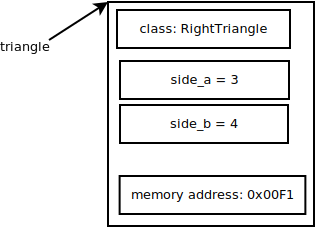

Object Oriented Programming
---------------------------

Think in the implementation of a function that calculates the area of a rectangle. You can't name it *area* because you have used this name for the right triangle area. You may call it *rectangle_area* and rename the other as *right_triangle_area*. And, what about the area of a circle? At the end you've got lots of functions something like *..._area*. It's a mess, and the solution is Object Oriented Programming.

This a simple code of OOP::

    class RightTriangle:
        def __init__(self, a, b):
            self.side_a = a
            self.side_b = b

        def area(self):
            return (self.side_a*self.side_b)/2.0

    triangle = RightTriangle(3, 4)
    print(triangle.area()) # 6.0

*class* means that we are going to give the abstract definition of something, in this case a right triangle. Forget for the moment that definition and look at this::

    triangle = RightTriangle(3, 4)

We're saying to the computer: "please, reserve some memory space for a new right triangle, and assign it to the name *triangle*". Now *triangle* references a new *instance* [#]_ of the class RightTriangle.

The expression ``RightTriangle(3, 4)`` not only allocates some space but **moves** the control of execution to the newly created triangle, concretely to the *__init__* [#]_ method [#]_ [#]_. The expression ``self.side_a = a`` means that this triangle instance says: "**my** attribute *side_a* now has got the value of the variable *a*, i.e. the integer 3".

.. [#] *instance* is a concrete *object* of a class. For example, Peter is a concrete person of the class Person.

.. [#] *__init__* also known as the *constructor*.

.. [#] *method* is the name we use to refer a function inside a *class*.

.. [#] actually there's no copy of the methods for each instance. As they don't change, they stay only at the definition of the class.

In the expression ``triangle.area()`` we are moving the control of execution to the *area* method of the *triangle* instance. Let's go to the definition of the method *area*::

    def area(self):
        return (self.side_a*self.side_b)/2.0

It means that this triangle instance says: "**I** will return the value of my side_a multiplied by my side_b and divided by 2".

Now, the rectangle example, which is quite similar::

    class Rectangle:
        def __init__(self, a, b):
            self.side_a = a
            self.side_b = b

        def area(self):
            return self.side_a*self.side_b

    rect = Rectangle(2, 3)
    print(rect.area()) # 6

Note that we are using the word *area* both in *RightTriangle* and in *Rectangle*. There's no mess.
